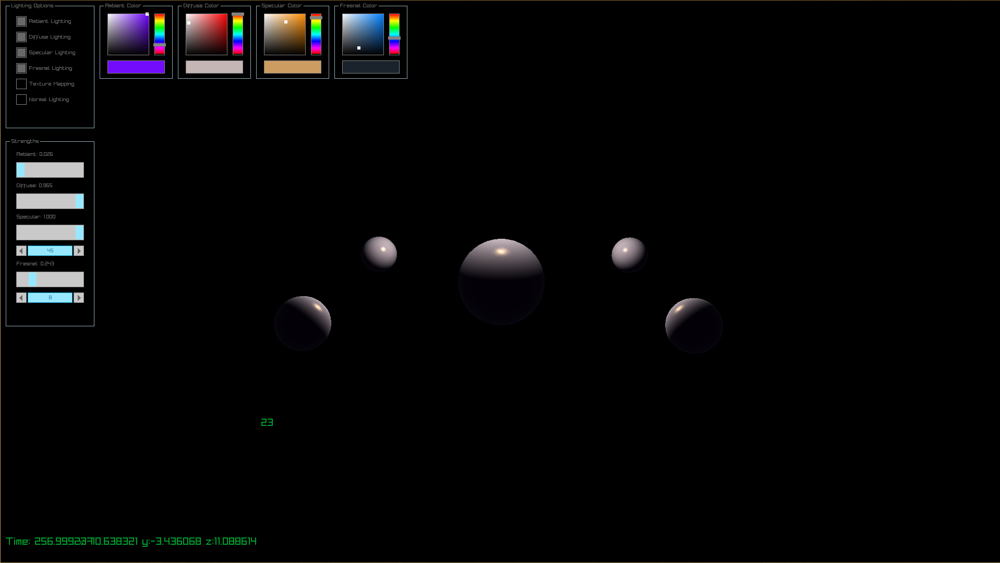
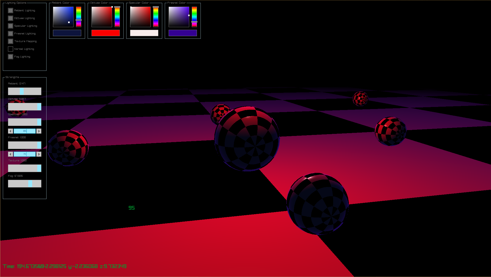

# Shading Experiments

## 1. Phong Shader

The Phong shading technique is build on a basis of relatively simple mathematics. In the following pictures you can see a demonstration wha Phong shading can look like.




---

# Configuration

```sh
# Getting the Project ready
git clone https://github.com/MrDiver/ShadingExperiments-Raylib.git
cd ShadingExperiments-Raylib
mkdir build
cmake ..
make
```
## Running the Project
```sh
# Running the project
./dist/rlProgram
```
